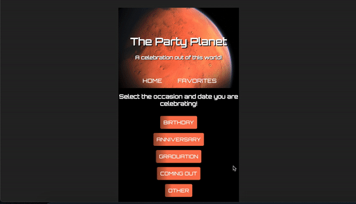
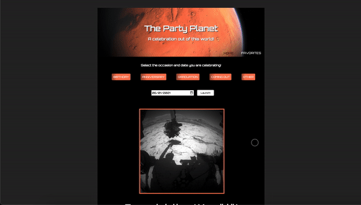

<h1 align="center">The Party Planet</h1>

- [Deployed App](https://the-party-planet.herokuapp.com/) 

The Party Planet is an application that allows a user to select a specific calendar day and then will display a photo of mars (provided by the NASA API) that was taken the same day. 

## Table of Contents

- [Project Goals](#project-learning-goals)
- [Installation](#installation)
- [Technologies Used](#technologies-used)
- [Functionality](#functionality)
- [Project Reflection](#project-reflection)
- [Contributors](#contributing)

## Project Learning Goals
- Use and become more familiar with technologies learned in the last 5 weeks. 
     - React 
     - Router
     - Asynchronous JavaScript
     - End to end testing with Cypress
- Create personas and user stories to describe target audience.
- Develop and deliver the MVP. 
- Work within constraints to deliver a product for a niche audience, which helps solve a problem unique to them. 

## Installation

1. Clone down this repository to a directory of your choice
2. <code>cd</code> into the repo
3. Run <code>npm i</code> to install dependencies
4. Run the command <code>npm run start</code> to run the application in your browser
5. Begin interacting!

#### Testing 
1. <code>npm i -D cypress</code>
2. Add the following to your package.json file
<pre><code>{
  "scripts": {
    "cypress": "./node_modules/.bin/cypress open"
  }
}</code></pre>
3. Then run <code>npm run cypress</code>
4. Select the mars-test.js file
5. Cypress will automatically open and the tests will start running. 

## Technologies Used
- 

- 

- 

- 

- 

- 

- 

## Functionality 
Upon visiting the app the user will be greeted with an animated title, a large photo of mars, and five occasion buttons. The user can select any of the occasion buttons to specify what the occasion they are celebrating is that day. If there is no specific occasion to celebrate the user can leave the buttons unselected. 

After the user selects an occasion button, enters a date into the input field, and presses the launch button a new photo will populate below and will be accompanied by some photo details. 

Once populated the user can view the new photo and will see two buttons on the right of the screen. If the "Celebrate" button is clicked then confetti will appear on the screen - this functionality was added with a react-confetti plugin. If the user decides they are drawn to the photo displayed then they have to option to favorite the image and it will be added to a Favorites page. 

The App is responsive and can easily be used on a mobile or tablet. 
#### Mobile:

#### Tablet: 

## Project Reflection 
Going into this project I was not particularly thrilled at the content I would be working with. For a time it was a challenge to learn to enjoy what I was building. Once I was able to get over that hump I ended up having a fun time with the project. The thrill of components coming together and working correctly to display content kept me going. The way all the pieces fell into place in the end was extremely rewarding. I particularly enjoyed adding the confetti animation to the main page. 

Becoming more familiar with React, Router, Cypress, and fetching APIs was extremely valuable. Creating a detailed plan and front-loading the work is what ultimately led to the success of the project. 

## Contributing

[][linkedin2]
[][github2]

[linkedin2]: https://www.linkedin.com/in/julia-iwinski-898540138/
[github2]: https://github.com/jgiwinski
